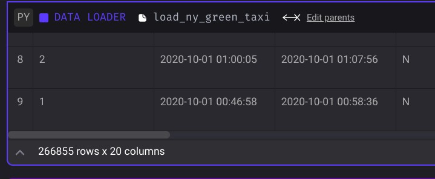
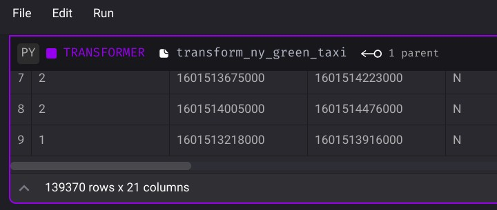
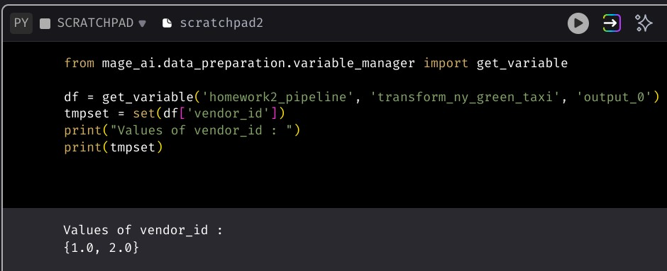
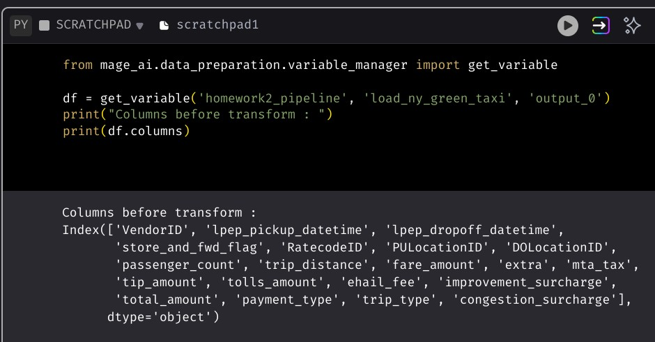
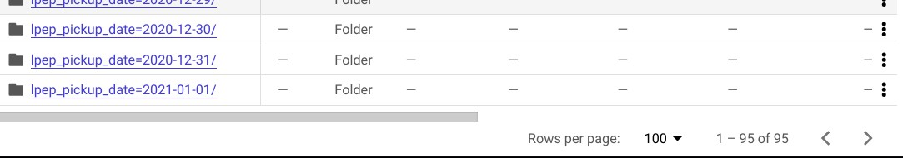

## Week 2 Homework

## Question 1. Data Loading

Once the dataset is loaded, what's the shape of the data?

* 266,855 rows x 20 columns <<==
* 544,898 rows x 18 columns
* 544,898 rows x 20 columns
* 133,744 rows x 20 columns

## Question 2. Data Transformation

Upon filtering the dataset where the passenger count is greater than 0 _and_ the trip distance is greater than zero, how many rows are left?

* 544,897 rows
* 266,855 rows
* 139,370 rows <<==
* 266,856 rows

## Question 3. Data Transformation

Which of the following creates a new column `lpep_pickup_date` by converting `lpep_pickup_datetime` to a date?

* `data = data['lpep_pickup_datetime'].date`
* `data('lpep_pickup_date') = data['lpep_pickup_datetime'].date`
* `data['lpep_pickup_date'] = data['lpep_pickup_datetime'].dt.date <<==`
* `data['lpep_pickup_date'] = data['lpep_pickup_datetime'].dt().date()`

## Question 4. Data Transformation

What are the existing values of `VendorID` in the dataset?

* 1, 2, or 3
* 1 or 2 <<==
* 1, 2, 3, 4
* 1

## Question 5. Data Transformation

How many columns need to be renamed to snake case?

* 3
* 6
* 2
* 4 <<==

## Question 6. Data Exporting

Once exported, how many partitions (folders) are present in Google Cloud?

* 96 <<==
* 56
* 67
* 108
